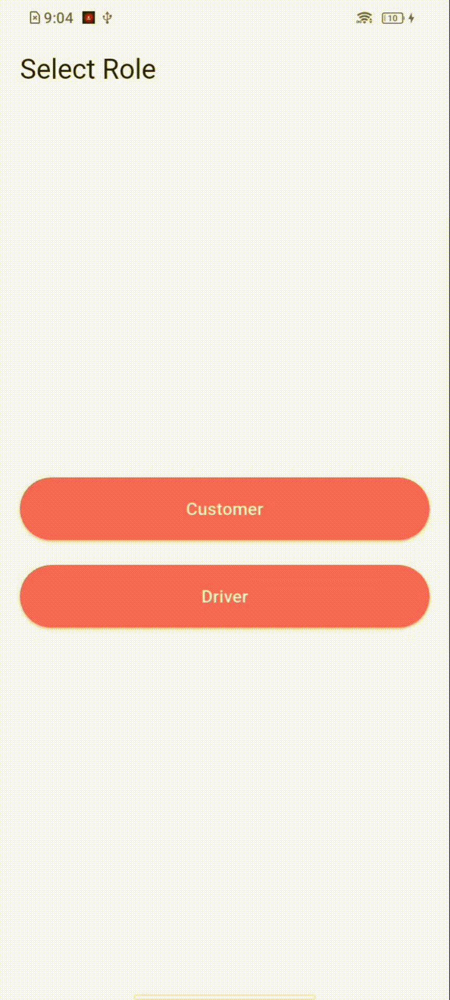

# 🚀 Flutter MVP - Real-Time Location Tracking App

A simple MVP (Minimum Viable Product) built using Flutter that demonstrates real-time location tracking between a **Customer** and a **Driver**.

---

## 🎬 App Demo

<p>
  <b>👤 Customer App</b> &nbsp;&nbsp;&nbsp;&nbsp;&nbsp;&nbsp;&nbsp;&nbsp;&nbsp;&nbsp;&nbsp;
  <b>🚚 Driver App</b>
</p>

<p>
  
  
</p>

---

## 📱 Features

### 👤 Role-Based Access

- Login screen with role selection:
  - Customer
  - Driver

---

### 🍔 Customer Features

- Create food order:
  - Select food item (dropdown)
  - Select quantity
  - Auto-calculated price & total
- Track driver in real-time on map
- Live location updates using Firestore streams

---

### 🚚 Driver Features

- View list of pending orders
- Accept an order
- Share live location continuously
- Complete order (stops tracking)

---

## 🗺️ Location

- Fetching real-time location using `geolocator`
- Converting coordinates to addresses using `geocoding`

---

## ☁️ Backend (Firebase)

- Cloud Firestore used for:
  - Storing orders
  - Updating driver location
  - Real-time syncing between customer & driver

---

## 🧠 State Management

- Provider used for:
  - Managing form state
  - Handling loading states
  - Business logic separation

---

## 📂 Project Structure

```

lib/
│
├── constants/         # App constants
├── providers/         # State management
├── screens/           # UI screens
├── services/          # App services (e.g., location)
├── utils/             # Firestore & helpers
├── widgets/           # Reusable components
└── main.dart

```

---

### 📱 App Flow

#### 👤 Customer Flow

1. Role Selection
2. Browse & Order Food
3. Wait for Order Acceptance
4. Track Driver Location (once the order is accepted)

#### 🚗 Driver Flow

1. Role Selection
2. View Pending Orders
3. Accept Order
4. Share Live Location (updates every 5 minutes)

---

## 🔥 Key Functionalities

- Real-time location tracking
- Firestore live data streaming
- Clean architecture (modular structure)
- Proper stream handling & disposal
- Background tracking awareness (app minimized)

---

## ⚙️ Dependencies

```yaml
firebase_core: ^4.6.0
cloud_firestore: ^6.2.0
google_maps_flutter: ^2.16.0
geolocator: ^14.0.2
provider: ^6.1.2
```

---

## 📲 Setup Instructions

### 1. Clone the Repository

```bash
git clone https://github.com/SVarunKumar-Dev/location_tracking.git
cd location_tracking
```

---

### 2. Install Dependencies

```bash
flutter pub get
```

---

### 3. Firebase Setup

1. Create a project in Firebase Console
2. Enable **Cloud Firestore**
3. Add Android/iOS app
4. Download config files:
   - `google-services.json` → `android/app/`
   - `GoogleService-Info.plist` → `ios/Runner/`

---

### 4. Run the App

```bash
flutter run
```

---

## 🔐 Permissions

### Android (`AndroidManifest.xml`)

```xml
<uses-permission android:name="android.permission.ACCESS_FINE_LOCATION"/>
<uses-permission android:name="android.permission.ACCESS_COARSE_LOCATION"/>
<uses-permission android:name="android.permission.ACCESS_BACKGROUND_LOCATION"/>
```

---

## 🧪 MVP Limitations

- No authentication (mock login)
- No push notifications
- Tracking stops if app is killed
- Single driver simulation

---

## 👨‍💻 Author

**Varun Kumar**
Flutter Developer (5+ Years Experience)

---
